# SysY2022 编译器

将 SysY2022 语言编译为 RV64GC 汇编的完整编译器，目标平台为 FPGA BOOM CPU 软核（medany 内存模型）。编译器只启用依赖程序语义和 IR 数据流的通用优化，不得通过函数名、测试名、输入值或测评环境特征触发专用优化。

AI 辅助说明：项目开发使用 OpenAI Codex 辅助合规审计、通用优化实现、正确性诊断、测试和文档整理。所有 AI 生成结果均由参赛队成员理解、人工复核、修改并通过回归测试后纳入项目，参赛队对最终实现和正确性负责。

## 目录

- [总体架构](#总体架构)
- [模块依赖链](#模块依赖链)
- [优化管线](#优化管线)
- [后端代码生成](#后端代码生成)
- [关键变换图解](#关键变换图解)
- [函数功能列表](#函数功能列表)
- [测试体系](#测试体系)
- [注释规范](#注释规范)
- [构建与测试命令](#构建与测试命令)

---

## 总体架构

编译器采用 **ParseTree → IR → Assembly** 的精简三段式架构，跳过独立 AST 层与语义分析阶段：ANTLR4 Visitor 直接从 ParseTree 生成 IR，IR 经分层优化管线后由后端生成 RV64GC 汇编。

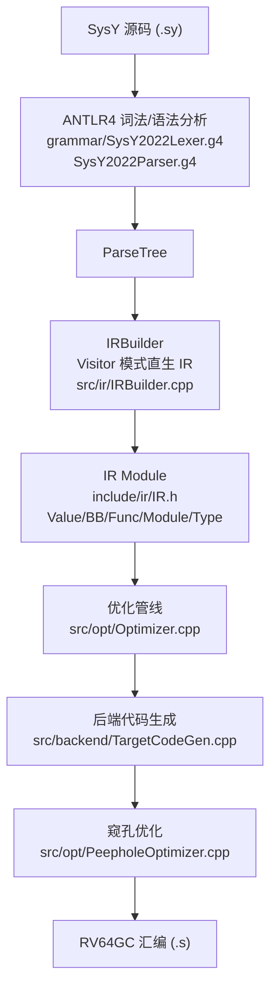

### 设计原则

- **无独立 AST 层**：直接使用 ANTLR4 Visitor 模式从 ParseTree 生成 IR，简化编译流程（ParseTree → IR → Assembly）。
- **无 SemanticAnalyzer**：假设输入程序无语法/语义错误。
- **分层优化管线**：O1→O2→O3→P0→P3 分阶段调度，每阶段后运行 CF/DCE 清理；阶段间迭代收敛（最多 2 次）。
- **目标导向优化**：针对 BOOM 微架构（16 项 ROB、14 周期分支误预测、单周期全流水 mul、4 周期 load-use）定制软件流水、分支概率布局、归约分裂、指令预取等硬件协同优化。

### BOOM 微架构约束

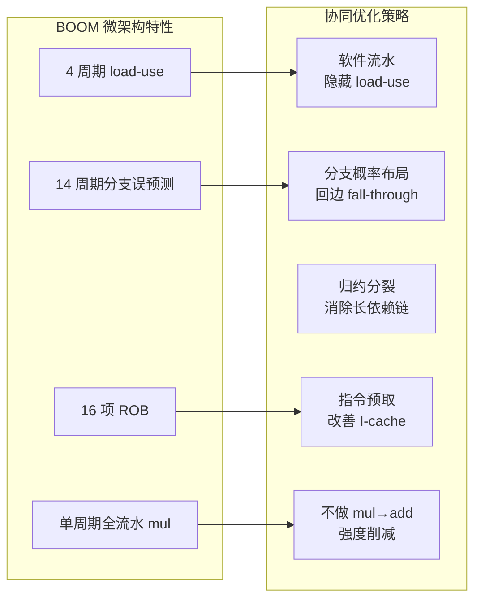

---

## 模块依赖链

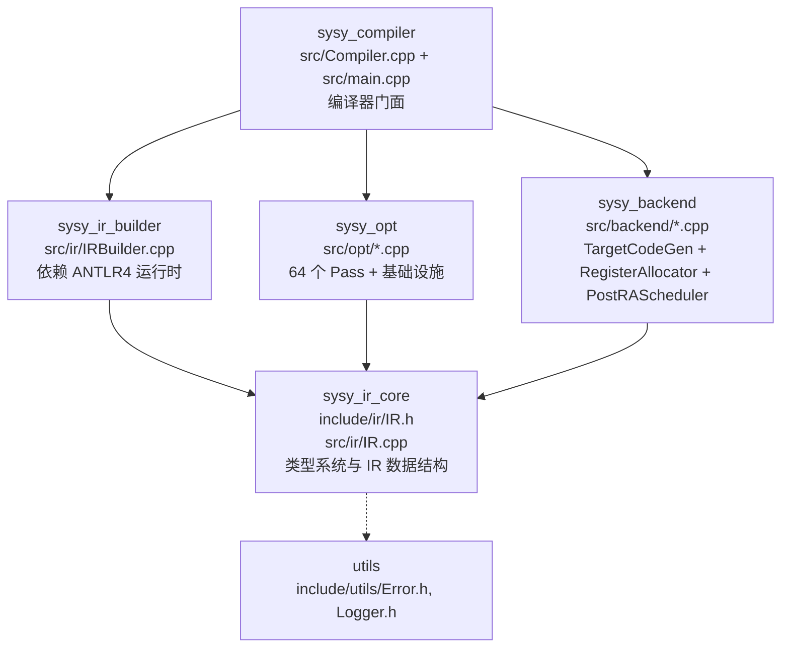

**库依赖关系**（CMakeLists.txt 定义）：

| 库                | 源文件                                   | 依赖                    |
| ----------------- | ---------------------------------------- | ----------------------- |
| `sysy_ir_core`    | `src/ir/IR.cpp`                          | 无                      |
| `sysy_ir_builder` | `src/ir/IRBuilder.cpp`                   | `sysy_ir_core` + ANTLR4 |
| `sysy_compiler`   | `src/Compiler.cpp`                       | `sysy_ir_builder`       |
| `sysy_opt`        | `src/opt/*.cpp`（64 个 Pass + 基础设施） | `sysy_ir_core`          |
| `sysy_backend`    | `src/backend/*.cpp`（3 个）              | `sysy_ir_core`          |

`compiler` 可执行文件链接：`sysy_compiler` + `sysy_backend` + `sysy_opt` + ANTLR4。

---

## 优化管线

优化 Pass 按管线阶段分组调度。每个 Pass 返回 `bool`（是否修改 IR），管线在每步后运行 `constantFolding` + `deadCodeElimination` 清理。开关机制：`OPT_DISABLE`/`OPT_ENABLE` 环境变量控制（见 [构建与测试命令](#构建与测试命令)）。

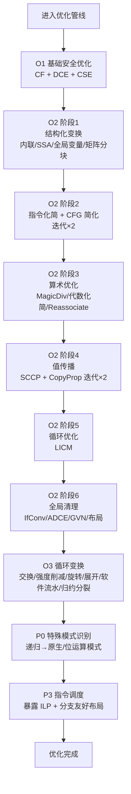

### O1 基础安全优化（`runO1`，总是有益、无依赖）

| 入口函数                         | 文件                      | 职责                          |
| -------------------------------- | ------------------------- | ----------------------------- |
| `constantFolding`                | `ConstantFolding.cpp`     | 常量折叠（编译期计算）        |
| `deadCodeElimination`            | `DeadCodeElimination.cpp` | 死代码消除（无 use 指令删除） |
| `commonSubexpressionElimination` | `CSE.cpp`                 | 公共子表达式消除（局部 CSE）  |

### O2 中层优化（`runO2`，分 6 阶段调度）

**阶段 1 — 结构化变换：**

| 入口函数                           | 文件                                   | 职责                                                          |
| ---------------------------------- | -------------------------------------- | ------------------------------------------------------------- |
| `treeShaking`                      | `TreeShaking.cpp`                      | 死函数消除（useCount=0 函数删除）                             |
| `modAddRecurrenceStrengthReduce`   | `NativeLowering.cpp`                   | 模加递推循环 → 原生加法+模运算                                |
| `localMemoryAccessOptimization`    | `LocalMemoryAccessOptimization.cpp`    | 基本块内短距离 GEP 复用与带别名检查的内存转发               |
| `redundantIterationElimination`    | `RedundantIterationElimination.cpp`    | 可证冗余的循环迭代消除                                        |
| `dynamicIdempotentLoopElimination` | `DynamicIdempotentLoopElimination.cpp` | 动态幂等循环迭代消除                                          |
| `recursiveMemoization`             | `RecursiveOpt.cpp`                     | 纯自递归函数 → 记忆化查表                                     |
| `repeatedDivRemToNative`           | `NativeLowering.cpp`                   | 重复除余提取 → 原生位运算                                     |
| `recursiveModularMulToNative`      | `NativeLowering.cpp`                   | 递归模乘 → WIDE_SMOD_MUL 指令                                 |
| `bitOpPatternRecognition`          | `BitOpPatternRecognition.cpp`          | 位运算函数调用 → 原生位指令                                   |
| `powerOfTwoDispatchSimplification` | `PowerOfTwoDispatch.cpp`               | 2 的幂次 switch 分派化简                                      |
| `tailRecursionElimination`         | `TailRecursionElimination.cpp`         | 尾递归 → 循环                                                 |
| `earlyReturnToSelect`              | `EarlyReturnToSelect.cpp`              | if-else-RET → SELECT+RET（单 BB 化）                          |
| `inlineExpansion`                  | `InlineExpansion.cpp`                  | 函数内联（热点循环内联 + 多 BB 克隆）                         |
| `mem2reg` / `mem2regLocal`         | `Mem2Reg.cpp`                          | SSA 构造（alloca/load/store → PHI）/ 局部 SSA 提升            |
| `globalVariablePromotion`          | `GlobalVariablePromotion.cpp`          | 标量全局变量 → 局部 ALLOCA                                    |
| `globalConstantPropagation`        | `GlobalConstantPropagation.cpp`        | 只读全局常量 → 常量替换                                       |
| `deadGlobalStoreElimination`       | `DeadGlobalStoreElimination.cpp`       | 无读/无逃逸全局的 STORE 消除                                  |
| `inplaceMatrixBlocking`            | `InPlaceMatrixBlocking.cpp`            | 原地矩阵乘缓存局部性分块                                      |

**阶段 2 — 指令级化简 + CFG 简化（迭代 2 次收敛）：**

| 入口函数                     | 文件                             | 职责                                               |
| ---------------------------- | -------------------------------- | -------------------------------------------------- |
| `instCombine`                | `InstCombine.cpp`                | 指令合并（代数恒等式 + Store-to-Load 前推）        |
| `deadStoreElimination`       | `DeadStoreElimination.cpp`       | 死存储消除                                         |
| `simplifyCFG`                | `SimplifyCFG.cpp`                | CFG 简化（常量分支折叠 + 不可达块删除 + 空块消除） |
| `jumpThreading`              | `JumpThreading.cpp`              | 跳转线程化（冗余跳转链消除）                       |
| `triangularCopyOptimization` | `TriangularCopyOptimization.cpp` | 下三角拷贝范围裁剪                                 |
| `conditionalMatrixBlocking`  | `ConditionalMatrixBlocking.cpp`  | 条件矩阵归约列融合                                 |

**阶段 3 — 算术优化（在值传播之前，产生新常量）：**

| 入口函数                  | 文件                          | 职责                                        |
| ------------------------- | ----------------------------- | ------------------------------------------- |
| `magicDivision`           | `MagicDivision.cpp`           | 常量除法 → 乘法 + 移位序列                  |
| `algebraicSimplification` | `AlgebraicSimplification.cpp` | 代数化简（强度削减 sdiv→ashr + 恒等式消除） |
| `reassociate`             | `Reassociate.cpp`             | 表达式重结合（优化常量折叠机会）            |
| `loadElimination`         | `LoadElimination.cpp`         | 冗余 LOAD 消除                              |

**阶段 4 — 值级别分析 + 传播（迭代 2 次收敛）：**

| 入口函数                               | 文件                  | 职责                             |
| -------------------------------------- | --------------------- | -------------------------------- |
| `sparseConditionalConstantPropagation` | `SCCP.cpp`            | 稀疏条件常量传播（结合分支条件） |
| `copyPropagation`                      | `CopyPropagation.cpp` | 复制传播                         |

**阶段 5 — 循环优化：**

| 入口函数                  | 文件       | 职责                                            |
| ------------------------- | ---------- | ----------------------------------------------- |
| `loopInvariantCodeMotion` | `LICM.cpp` | 循环不变量外提（NaturalLoop + innermost-first） |

**阶段 6 — 全局清理与最终优化：**

| 入口函数                        | 文件                                | 职责                                        |
| ------------------------------- | ----------------------------------- | ------------------------------------------- |
| `ifConversion`                  | `IfConversion.cpp`                  | 条件转换（empty-else 菱形 → select）        |
| `adce`                          | `ADCE.cpp`                          | 激进死代码消除（基于后支配者）              |
| `codeSink`                      | `CodeSink.cpp`                      | 代码下沉（减少寄存器压力）                  |
| `basicBlockReordering`          | `BasicBlockReordering.cpp`          | 基本块重排（支配树 DFS + 分支概率引导布局） |
| `globalValueNumbering`          | `GVN.cpp`                           | 全局值编号（支配树跨 BB CSE）               |
| `stencilInteriorSpecialization` | `StencilInteriorSpecialization.cpp` | 模板内部边界特化                            |
| `matrixReductionContraction`    | `MatrixReductionContraction.cpp`    | 矩阵归约收缩                                |

### O3 循环特定变换（`runO3`，在 O2 通用优化之后）

| 入口函数             | 文件                     | 职责                                                       |
| -------------------- | ------------------------ | ---------------------------------------------------------- |
| `loopInterchange`    | `LoopInterchange.cpp`    | 循环交换（优化访存局部性）                                 |
| `loopStrengthReduce` | `LoopStrengthReduce.cpp` | 循环强度削弱（MUL → 累加，BOOM mul 单周期默认禁用）        |
| `loopRotation`       | `LoopRotation.cpp`       | 循环旋转（while → guard + do-while，回边 fall-through 化） |
| `loopFullUnroll`     | `LoopFullUnroll.cpp`     | 循环完全展开（tc ≤ 64）                                    |
| `softwarePipelining` | `SoftwarePipelining.cpp` | 软件流水（跨迭代 LOAD 预取，隐藏 load-use 延迟）           |
| `reductionSplitting` | `ReductionSplitting.cpp` | 归约分裂（多累加器，消除长依赖链）                         |
| `loopUnrolling`      | `LoopUnrolling.cpp`      | 循环部分展开（最大 16×，tc ≤ 256）                         |
| `gepStrengthReduce`  | `GEPStrengthReduce.cpp`  | GEP 地址计算强度削弱                                       |

### P0 特殊模式识别（`runP0`，语义级优化）

| 入口函数                   | 文件                          | 职责                               |
| -------------------------- | ----------------------------- | ---------------------------------- |
| `bitOpPatternRecognition`  | `BitOpPatternRecognition.cpp` | 位运算模式识别                     |
| `hoistRecursiveCallGuards` | `RecursiveOpt.cpp`            | 递归调用守卫提升（base-case 短路） |

### P3 指令调度（`runP3`）

| 入口函数                | 文件                        | 职责                                |
| ----------------------- | --------------------------- | ----------------------------------- |
| `instructionScheduling` | `InstructionScheduling.cpp` | 指令调度（暴露 ILP + 分支友好布局） |

### 优化基础设施（供其他 Pass 调用）

| 入口函数                                                                                                                                  | 文件                       | 职责                                                              |
| ----------------------------------------------------------------------------------------------------------------------------------------- | -------------------------- | ----------------------------------------------------------------- |
| `buildPredecessors`/`buildSuccessors`/`computeDominators`/`computePostDominators`/`computeImmediateDominators`/`computeDominanceFrontier` | `DominatorAnalysis.cpp`    | 支配者分析基础设施                                                |
| `computeDomTreeLR`/`dominatesLR`                                                                                                          | `DominatorAnalysis.cpp`    | 支配树 DFS L/R 区间编码（O(1) 支配查询）                          |
| `findNaturalLoops`/`getLoopsInnermostFirst`                                                                                               | `LoopFind.cpp`             | 自然循环森林检测                                                  |
| `analyzeLoopInduction`                                                                                                                    | `SCEVAnalysis.cpp`         | 标量演化分析（归纳变量 CR 链）                                    |
| `passEnabled`                                                                                                                             | `PassManager.cpp`          | 参数化 Pass 开关（黑/白名单）                                     |
| `detectPureFunctions`/`isPureFunction`                                                                                                    | `PureFuncDetection.cpp`    | 纯函数识别（迭代至不动点）                                        |
| `readOnlyGlobalAnalysis`                                                                                                                  | `ReadOnlyGlobal.cpp`       | 只读全局变量分析                                                  |
| `phiLowering`                                                                                                                             | `PhiLowering.cpp`          | PHI 降级（PHI → ALLOCA + STORE + LOAD）                           |
| `buildAllocaArgumentMap`/`collectPointerAccess`/`analyzeAffineRecurrence`/`analyzeAllocaScalarReduction`/`analyzeCanonicalCountedLoop`    | `LoopAnalysis.cpp`         | 循环分析合并模块（访存分解 + 仿射递推 + 标量归约 + 计数循环模式） |
| `analyzeGlobalMemoryEffects`                                                                                                              | `MemoryAccessAnalysis.cpp` | 全局对象内存效应分析（地址逃逸检测）                              |

---

## 后端代码生成

后端将优化后的 IR 转换为 RV64GC 汇编，经寄存器分配、PostRA 调度与窥孔优化后输出。主编译流程为 `compile → runOptPasses → TargetCodeGen::generate → peepholeOptimize`。

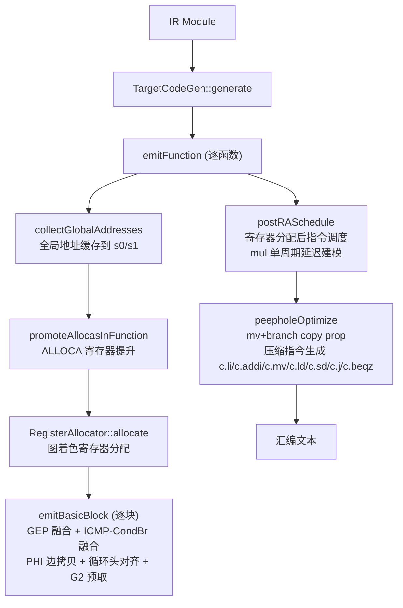

### 后端组件

| 文件                                | 入口函数/类                       | 职责                                                                                                                                       |
| ----------------------------------- | --------------------------------- | ------------------------------------------------------------------------------------------------------------------------------------------ |
| `src/backend/TargetCodeGen.cpp`     | `TargetCodeGen::generate(module)` | IR → RV64GC 汇编（ALLOCA 寄存器提升 + GEP 融合 + ICMP-CondBr 融合 + PHI 边拷贝 + 全局地址缓存 + 循环头对齐 + WIDE_SMOD_MUL + G2 指令预取） |
| `src/backend/RegisterAllocator.cpp` | `RegisterAllocator`               | 图着色寄存器分配（callee-saved 管理 + 溢出决策 + PHI 合并）                                                                                |
| `src/backend/PostRAScheduler.cpp`   | `PostRAScheduler`                 | 寄存器分配后指令调度（mul 单周期延迟建模）                                                                                                 |
| `src/opt/PeepholeOptimizer.cpp`     | `peepholeOptimize(asmCode)`       | 窥孔优化（mv+branch copy propagation + 压缩指令生成 + 死 trampoline 清理）                                                                 |

### 寄存器分配策略

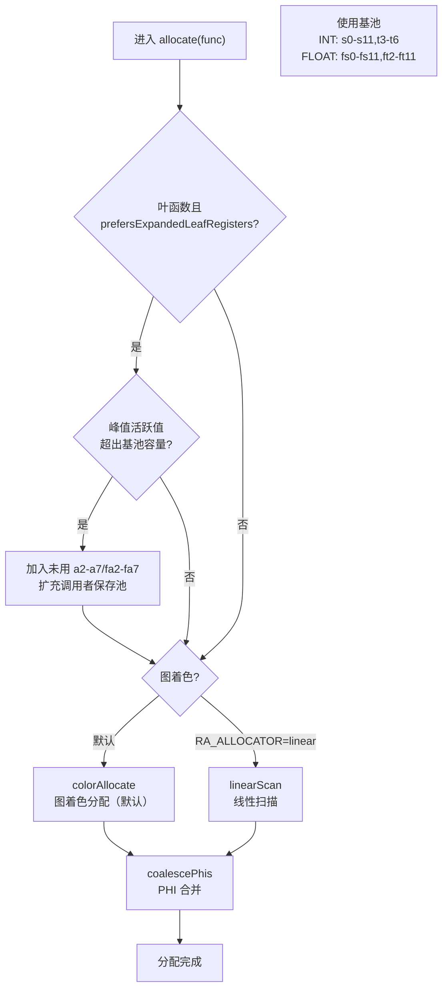

INT 寄存器池排除 a0-a7（避免调用点大量保存/恢复开销），FLOAT 排除 fa0-fa7；ft0/ft1 保留为浮点 scratch。G2 指令预取使用 t0(x5)，不在 RA 的 INT_REGS 池（s0-s11,t3-t6）中，确保不干扰跨块活跃值。

---

## 关键变换图解

### If-Conversion（菱形分支 → select）

将菱形控制流（cond → then/else → merge PHI）转换为 SELECT 指令，消除条件跳转。仅当 then/else 块中的指令可安全投机执行（无 STORE/LOAD/CALL/SDIV 等副作用）时触发。

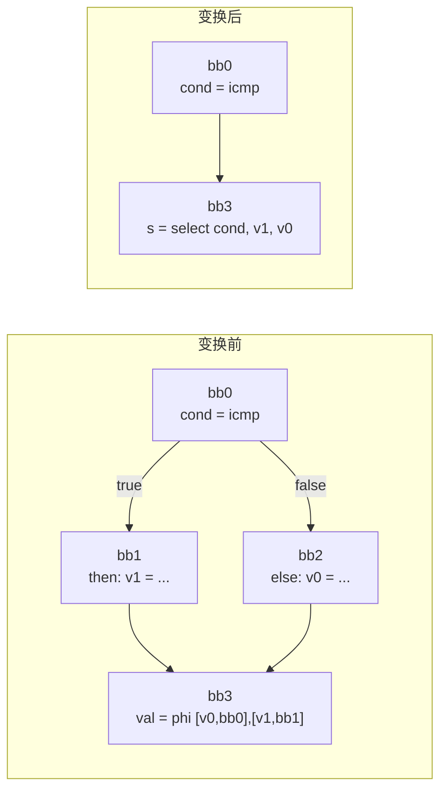

### LoopRotation（while → guard + do-while）

将 Header 退出循环旋转为 Latch 退出循环，使回边 fall-through，减少分支误预测。

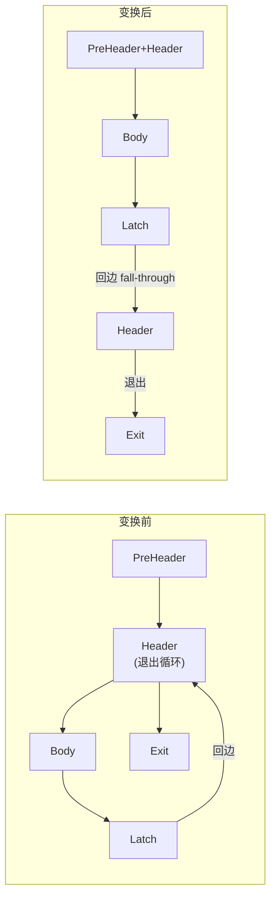

### G2 指令预取（Zicbop prefetch.i）

在每个循环头对应的"非回边、布局最近"的 preheader 块首注入 `prefetch.i` 指令，预取循环体指令到 BOOM L1 I-cache，改善指令缓存局部性。

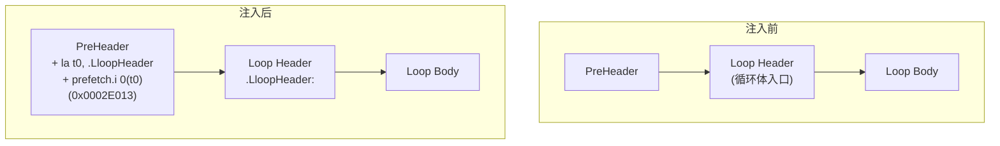

- 寄存器安全：t0(x5) 不在 RA 的 INT_REGS 池（s0-s11,t3-t6）中，块首 clobber 安全。
- 编码：`prefetch.i 0(t0)` 编码为 `0x0002E013`，可在纯 RV64GC（不含 zicbop）上汇编链接运行。
- PeepholeOptimizer 的死 trampoline 清理已识别 `la`/`lui` 标签引用，不会误删预取目标标签。
- 开关：`G2_OFF=1` 关闭，`G2_MINLOOP=N` 调整最小循环体门限（默认 4）。

### SimplifyCFG 空块合并

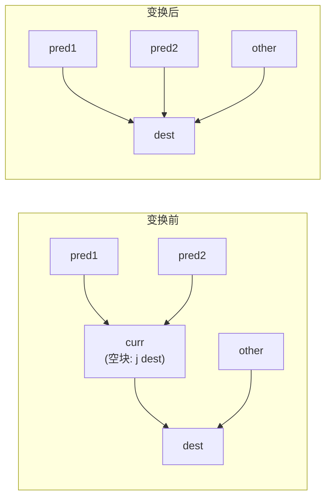

### SoftwarePipelining（跨迭代 LOAD 预取）

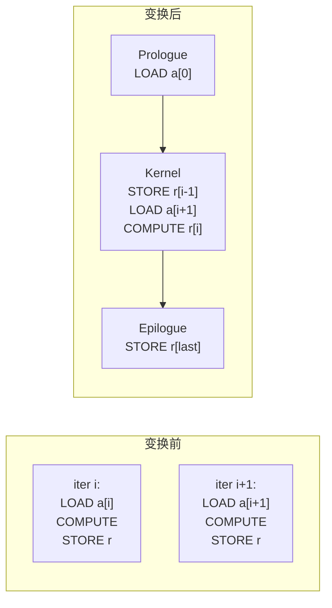

隐藏 BOOM 4 周期 load-use 延迟。使用 step-aware 迭代计数计算（`inferTripCount` + `traceAddChain`/`computeAllocaStep`，要求 `(bound-init) % step == 0`）。开关 `SWP_OFF=1` 禁用。

---

## 函数功能列表

### 前端（Frontend）

| 文件                        | 入口函数                         | 职责                                                        |
| --------------------------- | -------------------------------- | ----------------------------------------------------------- |
| `grammar/SysY2022Lexer.g4`  | —（ANTLR4 生成）                 | SysY2022 词法规则                                           |
| `grammar/SysY2022Parser.g4` | —（ANTLR4 生成）                 | SysY2022 语法规则                                           |
| `src/ir/IRBuilder.cpp`      | `IRBuilder::compile(sourcePath)` | Visitor 模式从 ParseTree 直接生成 IR Module                 |
| `src/main.cpp`              | `main()`                         | 命令行解析 + 调度编译流程                                   |
| `src/Compiler.cpp`          | `Compiler::emitAsmToFile()`      | 编译门面：compile → runOptPasses → TargetCodeGen → peephole |

### 中间表示（IR）

| 文件                                | 核心类型/函数                                                                                                                                                                                   | 职责                         |
| ----------------------------------- | ----------------------------------------------------------------------------------------------------------------------------------------------------------------------------------------------- | ---------------------------- |
| `include/ir/IR.h` / `src/ir/IR.cpp` | `Value`, `Instruction`, `BasicBlock`, `Function`, `Module`, `Type`/`IntegerType`/`FloatType`/`ArrayType`/`FunctionType`, `Constant`/`ConstantInt`/`ConstantFloat`, `Argument`, `GlobalVariable` | IR 类型系统与数据结构        |
| `include/ir/IRBuilder.h`            | `IRBuilder`                                                                                                                                                                                     | IR 构造器（Visitor 直生 IR） |

---

## 测试体系

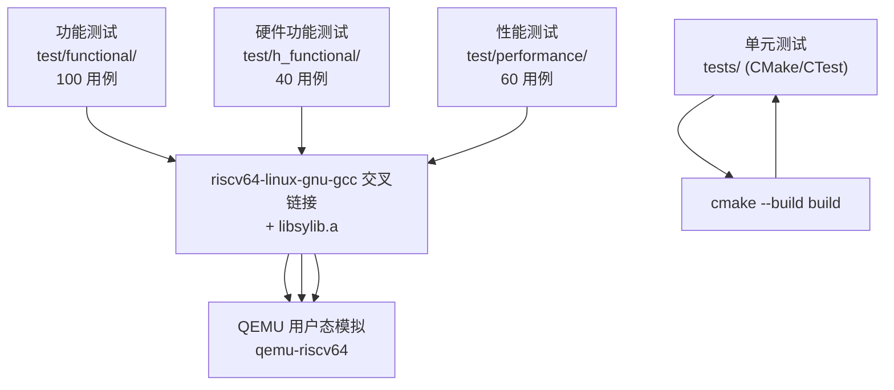

### 单元测试（`tests/`，CMake/CTest 驱动）

| 测试可执行文件            | 源文件                                      | 覆盖范围                                     | 运行命令                                            |
| ------------------------- | ------------------------------------------- | -------------------------------------------- | --------------------------------------------------- |
| `test_ir`                 | `tests/test_ir.cppx`                        | IR 数据结构 + IRBuilder + Mem2Reg + 基础优化 | `ctest --test-dir build -R ir_unit`                 |
| `test_integration`        | `tests/test_integration.cppx`               | 端到端编译流程（源码 → IR → 汇编）           | `ctest --test-dir build -R compiler_integration`    |
| `test_peephole`           | `tests/test_peephole.cppx`                  | 后端窥孔优化 + TargetCodeGen 安全性          | `ctest --test-dir build -R peephole_unit`           |
| `test_matrix_blocking`    | `tests/test_matrix_blocking.cppx`           | 矩阵分块合法性 + 触发条件                    | `ctest --test-dir build -R matrix_blocking_unit`    |
| `test_register_allocator` | `tests/test_register_allocator.cpp`（可选） | 寄存器分配回归                               | `ctest --test-dir build -R register_allocator_unit` |

### 系统测试（QEMU 模拟执行）

| 套件         | 目录                 | 用例数 | 运行脚本                             | 期望基线（-O1/OALL）   |
| ------------ | -------------------- | ------ | ------------------------------------ | ---------------------- |
| 功能测试     | `test/functional/`   | 100    | `bash scripts/run_tests.sh func O1`  | 97 OK / 3 DIFF / 0 TO¹ |
| 硬件功能测试 | `test/h_functional/` | 40     | `bash scripts/run_tests.sh hfunc O1` | 36 OK / 4 DIFF²        |
| 性能测试     | `test/performance/`  | 60     | `bash scripts/test_perf_wsl.sh`      | 60/60 PASS             |

> ¹ 62_percolation / 68_brainfk / 71_full_conn 在合并基线即失败（非本轮引入）。
> ² 12_DSU / 21_union_find / 30_many_dimensions / 35_math 在合并基线即失败。

**测试运行前准备：**

```bash
# 构建 sylib 运行时库（QEMU 链接所需）
bash scripts/build_sylib.sh
```

**本地逐级调试（小写 -o 精确控制优化级别）：**

```bash
bash scripts/run_tests.sh func o0   # 无优化基准
bash scripts/run_tests.sh func o1   # 仅 O1
bash scripts/run_tests.sh func o2   # O1 + O2
bash scripts/run_tests.sh func o3   # O1 + O2 + O3
bash scripts/run_tests.sh all  o0   # 全部套件 O0
```

---

## 注释规范

### 文件头块（统一格式）

每个源文件（`.cpp`/`.h`）以统一格式的注释头块开头：

```cpp
// ================================================================
// <文件路径> — <一句话职责>
// ----------------------------------------------------------------
// 所属模块：<frontend / ir / opt / backend / utils>
// 关键依赖：<被依赖的头文件 / 被调用的基础设施 pass>
// 环境开关：<OPT_DISABLE / XXX_OFF 等控制项，若无则省略此行>
// 注意事项：<正确性约束 / 已知陷阱，若无则省略此行>
// ================================================================
```

### inline 注释

- **单行注释为主**：使用 `//`（不使用 `/* */` 单行）。
- **`//` 后加一个空格**：`// 注释内容`，而非 `//注释内容`。
- **多行块注释**：使用 `//` 逐行或 `/* */` 块（仅用于大段说明）。
- **领域逻辑用中文**：与现有代码一致，优化策略、微架构约束、正确性陷阱用中文注释。
- **删除被注释掉的死代码**：不保留注释掉的实现。
- **注释与代码间一个空格**：`code; // 注释`。

### 合并文件结构

合并多个同族 Pass 的 `.cpp` 文件时，每节保留独立注释分隔块，标注原文件名与合并说明。由于 C++ 匿名命名空间在同文件内合并，跨节重名的 helper 函数需删除重复定义（保留首个定义，其余节以注释标注"已由第 N 节提供"）。

---

## 构建与测试命令

### 环境要求

- Ubuntu 24.04 x86（WSL 或原生）
- ANTLR4 C++ 运行时 4.13.1（`scripts/setup/setup-ubuntu.sh` 安装）
- `qemu-riscv64`（QEMU 用户态模拟）
- RISC-V 交叉编译工具链（`scripts/install_riscv.sh`，若存在）

### 构建

```bash
mkdir build && cd build
cmake .. -DCMAKE_BUILD_TYPE=Release
make -j$(nproc)
```

### 优化级别

测评服务器仅支持 `-O1`，编译器将其映射为最高优化级别（OALL = O1+O2+O3+P0+P3）：

| 命令行参数 | 内部级别 | 包含的优化                                     | 用途               |
| ---------- | -------- | ---------------------------------------------- | ------------------ |
| `-O1`      | OALL     | O1 + O2 + O3 + P0 + P3                         | **测评服务器使用** |
| `-O0`      | O0       | 无优化                                         | 评测基准           |
| `-o0`      | O0       | 无优化                                         | 本地调试           |
| `-o1`      | O1       | CF + DCE + CSE                                 | 本地逐级调试       |
| `-o2`      | O2       | O1 + 内联 + SSA + SCCP + LICM + CFG + 矩阵分块 | 本地逐级调试       |
| `-o3`      | O3       | O1+O2 + 循环交换/强度削减/旋转/展开/软件流水   | 本地逐级调试       |

> 大写 `-O1` 对应全部优化（映射到 OALL），小写 `-o1` 对应仅 O1。设计原因：测评服务器只支持 `-O1`，必须在此选项下输出最佳性能。

### 使用示例

```bash
# 编译为汇编（测评服务器调用方式）
./build/compiler -S -o output.s input.sy -O1

# 输出 IR（调试用）
./build/compiler -o output.ir input.sy -o3
```

### Pass 开关（环境变量）

| 环境变量               | 作用                                                               | 示例                                                               |
| ---------------------- | ------------------------------------------------------------------ | ------------------------------------------------------------------ |
| `OPT_DISABLE`          | 黑名单：禁用指定 Pass                                              | `OPT_DISABLE="gvn,licm" ./build/compiler -S -o out.s in.sy -O1`    |
| `OPT_ENABLE`           | 白名单：只运行指定 Pass（非空时优先于一切）                        | `OPT_ENABLE="mem2reg,sccp" ./build/compiler -S -o out.s in.sy -O1` |
| `OPT_FORCE_ENABLE`     | 强制启用被 builtinDisable 禁用的 Pass（不覆盖 OPT_DISABLE 黑名单） | —                                                                  |
| `OPT_DISABLE_GVN=1`    | 兼容旧开关：禁用 GVN                                               | —                                                                  |
| `G2_OFF=1`             | 禁用指令预取                                                       | —                                                                  |
| `G2_MINLOOP=N`         | 指令预取最小循环体门限（默认 4）                                   | —                                                                  |
| `P6_OFF=1`             | 禁用宏指令融合                                                     | `P6_OFF=1 ./build/compiler ...`                                    |
| `P8_OFF=1`             | 禁用软件流水（旧）                                                 | —                                                                  |
| `SWP_OFF=1`            | 禁用跨迭代 LOAD 预取（软件流水）                                   | —                                                                  |
| `LAYOUT_PROB_OFF=1`    | 禁用分支概率引导布局                                               | —                                                                  |
| `SCHED_OFF=1`          | 禁用 PostRA 指令调度                                               | —                                                                  |
| `LOOP_ROTATE_OFF=1`    | 禁用循环旋转                                                       | —                                                                  |
| `ROT_ALLOCA_OFF=1`     | 禁用 alloca-IV 循环旋转路径                                        | —                                                                  |
| `NO_PEEPHOLE=1`        | 禁用窥孔优化                                                       | —                                                                  |
| `DEBUG_LOWER_PHI=1`    | 启用 PHI 降级（调试）                                              | —                                                                  |
| `DUMP_PEEPHOLE_PRE=1`  | 输出窥孔优化前汇编到 `/tmp/peep_pre.S`                             | —                                                                  |
| `DUMP_PEEPHOLE_POST=1` | 输出窥孔优化后汇编到 `/tmp/peep_post.S`                            | —                                                                  |

### 调试脚本

| 脚本                                                           | 用途                               |
| -------------------------------------------------------------- | ---------------------------------- |
| `scripts/run_tests.sh <func\|hfunc\|all> <O1\|o0\|o1\|o2\|o3>` | 运行功能/硬件功能测试              |
| `scripts/test_perf_wsl.sh`                                     | 运行性能测试（自动检测 qemu 路径） |
| `scripts/quick_test.sh`                                        | 快速冒烟测试                       |
| `scripts/differential_test.sh`                                 | 差分测试（对比不同优化级别输出）   |
| `scripts/exp_gvn_ab.sh`                                        | GVN A/B 实验脚本                   |
| `scripts/build_sylib.sh`                                       | 构建 sylib 运行时库                |
| `scripts/clean.sh`                                             | 清理构建产物                       |
